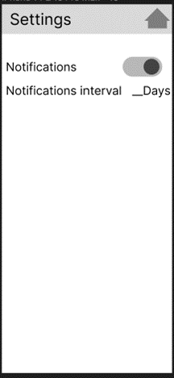

# MAD24_P04_Team2

# Team Members:
Jaden 
Joshua 
Rumaisa 
Brian 
Ethan 
# Introduction
The goal of the project is to create a flashcard app that would allow users to add questions and answers to test themselves. The app also consists of a memo page to allow users to write quick reminders or notes to revise before testing themselves. In the memo they would be able to add text, image, video, and audio. There would also be other features to ensure a smooth study period, such as a study session timer and notifications to remind the user to study. Addtionally, there will be a login feature to ensure security of the app.

# Motivation/Objective
This app is to enable students to be able to easily create flashcards and be able to rewiew them practicing their different subject. The app is also trying to reduce the amount of paper being used when students make flashcard and allow the students to take them wherever they go as it is all in their phones. This app is also trying to allow the users to create healthy study habits and not get distracted during their study.

# App category 
The category of the app is Educational

# Stage 1 Task
**(All pages use responsive layout to scale to the correct size of the phone)**

Feature 1- logging in (User Identity from core android developer guide) (Joshua): 
Android developer guide for User identity - https://developer.android.com/training/sign-in 
•	Create a login page that allow users to enter their username and password 
•	Create a register page that allows users to register an account 
•	Move to an authentication page where the user needs to key the OTP shown in a toaster 

 
Feature 2 – Flashcards (Persistent memory + recycler view) (Jaden): 
•	There will be a button on the main screen go to “flash card decks page” 
•	In the “flash card decks page” user can either review deck or create new deck 
•	When user create new deck, they must first enter a name 
•	After entering a name, they will be directed to make new cards page where they can enter words in the front and back of the card.  
•	After making the card they can either make a new card or finish to stop making cards. 
•	If the user clicks to the review deck, they would be able to view the front of the deck and there will be a view answer button. 
•	They can then click if they got the question right and go to the next card. 

 
Feature 3 – Memo (Persistent memory + Multimedia) (Ethan): 
•	In the main page, there will be a button to go to the memo page. 
•	The memo page is for short notes for the user know 
•	They can add a memo or view the memo 
•	In the add memo, user can add text, video, image, and audio. 
•	The user will be limited to a certain number of characters or one video or one image or one audio 

 
Feature 4 - Study sessions (alarm from core android developer guide) (Rumaisa): 
Android developer guide for alarm - https://developer.android.com/develop/background-work/services/alarms  
•	In the main page, there will be a button to set study sessions. 
•	In the study sessions page, users will be able to set an alarm that will go off in 1-60 mins. 
•	This alarm will still work in the background if the user is still in the app. 
 

Feature 5 – Notifications (Services from core android developer guide) (Brian): 
Android developer guide for service -  https://developer.android.com/develop/background-work/services 
•	There will be a settings page to enable the notification 
•	The user will be able to set the time interval of the notification 
•	The notification will then play in the app after the user did not use the app for the specified time interval. 
•	This will still work if the app is closed. 

# Stage 2 Task
Feature 1 - Speech to text for answering questions (Using API from google) (Ethan) 
•	There will be a button while reviewing the flashcard to get the users input. 
•	The speech would be processed into text using google's api 
•	The text would then be compared to check if it is similar to the answer  

Feature 2 - Allow user to share decks with others globally and allow for rating (using firebase cloud messaging) 
(Jaden) 
•	There will be a button to share the flashcard deck gloabally 
•	There will be a page to view decks shared gloabally 
•	In that page users will be able to review the deck and rate them. 

Feature 3 - Allow users to swipe for deleting and editing cards. (using recycler views in a fragment.) (Rumaisa) 
•	There will be a new button on the deck to manage the deck 
•	When the user clicks that button, they will be able to manage the deck deleting cards and editing the cards. 

Feature 4 - Fingerprint login to increase security. (use biometric sensor) (Joshua) 
•	In the log in page the user will be able to use their biometrics to log in to their app 
•	The app will have a memory of what biometric there are and will make sure it is the right one 

Feature 5 - Export and import page for back up of the app (Brian) 
•	There will be a button for the user to export to a txt file 
•	There will also be another button for the user to import the txt file only if the file is having the same format 
•	On importing the file, the app will create that deck on the app for the user. 